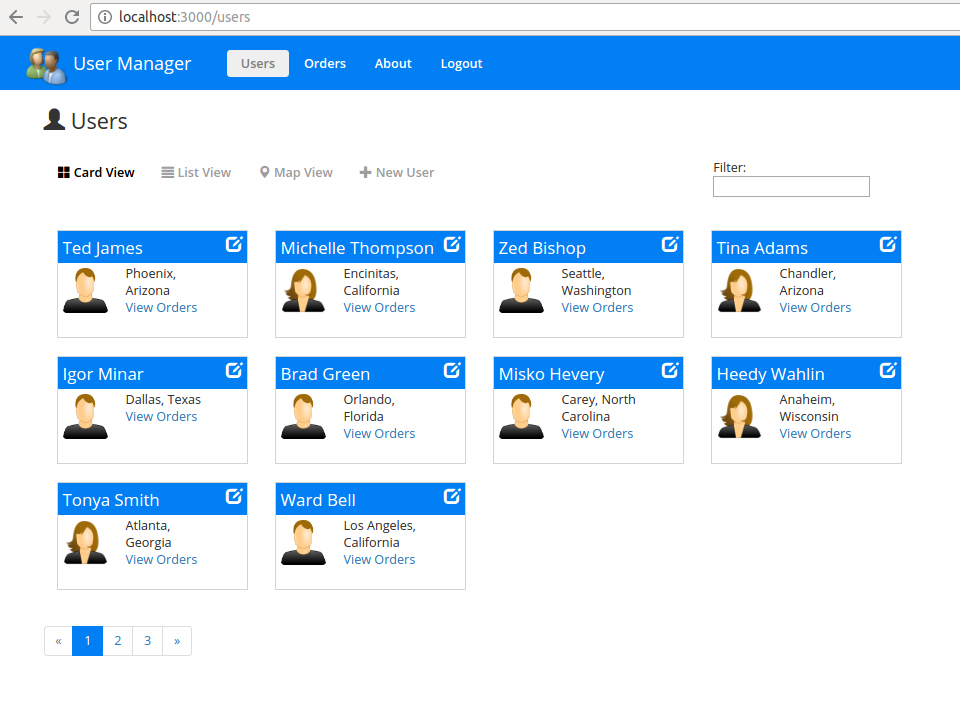
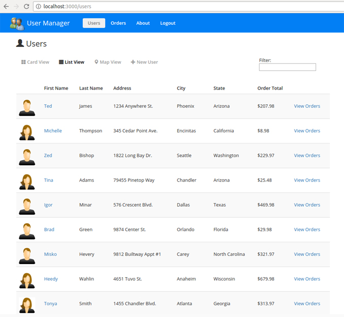
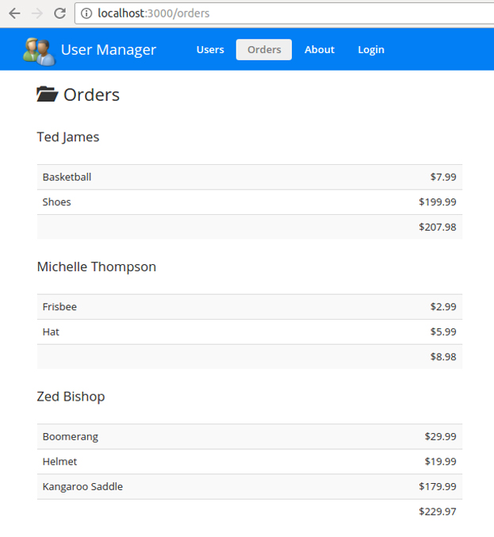
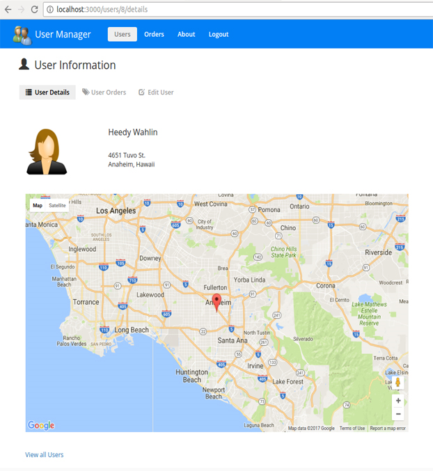

# User Management System with Angular 2, TypeScript and Webpack

## Running the Application

1. Install `Node.js 6.5` or higher. *IMPORTANT: The server uses ES2015 features so you need Node 6.x or higher!!!!*

1. Run `npm install` to install app dependencies

1. Run `npm start` in a separate terminal window to build the TypeScript, watch for changes and launch the web server

1. Go to http://localhost:3000 in your browser

The goal of this User Management System app is to provide
a simple way to get started with Angular 2+ while also showing several key Angular features. 

## Angular Concepts Covered

* TypeScript version that relies on classes and modules
* Defining routes including child routes and lazy loaded routes
* Using Custom Components including custom input and output properties
* Using Custom Directives
* Using Custom Pipes
* Defining Properties and Using Events in Components/Directives
* Using the Http object for Ajax calls along with RxJS observables
* Working with Utility and Service classes (such as for sorting and Ajax calls)
* Using Angular databinding Syntax [], () and [()]
* Using template-driven and reactive forms functionality for capturing and validating data

Simply clone the project or download and extract the .zip to get started. Here are a few
screenshots from the app:

  

  

  

